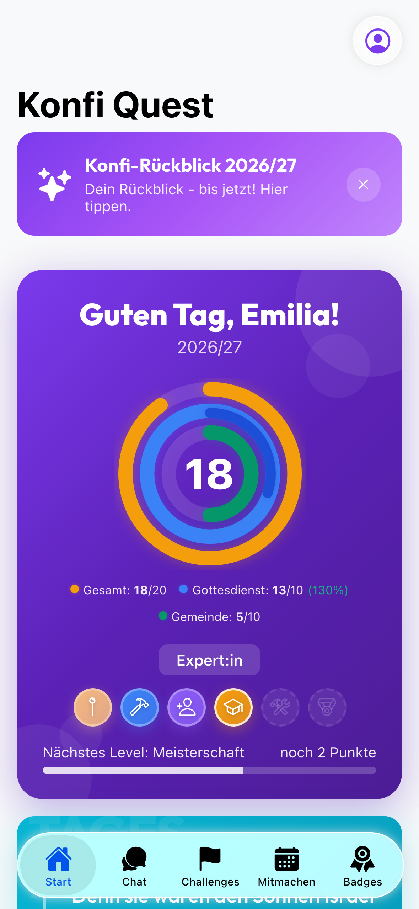
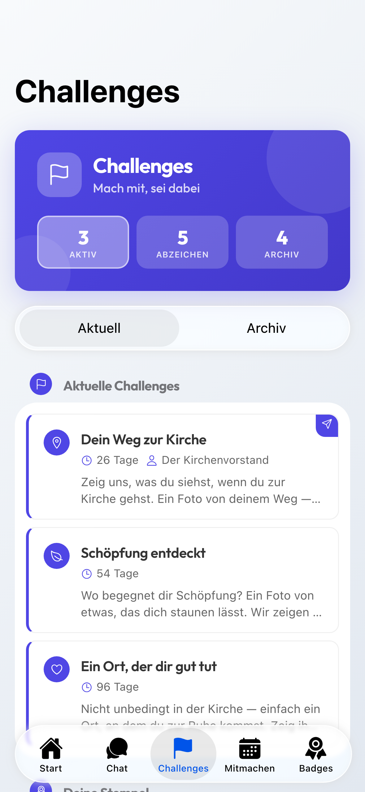
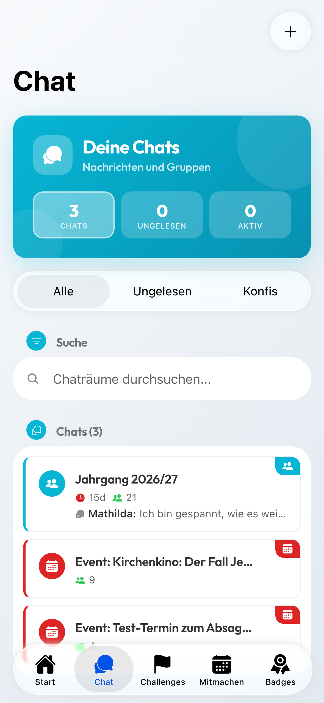
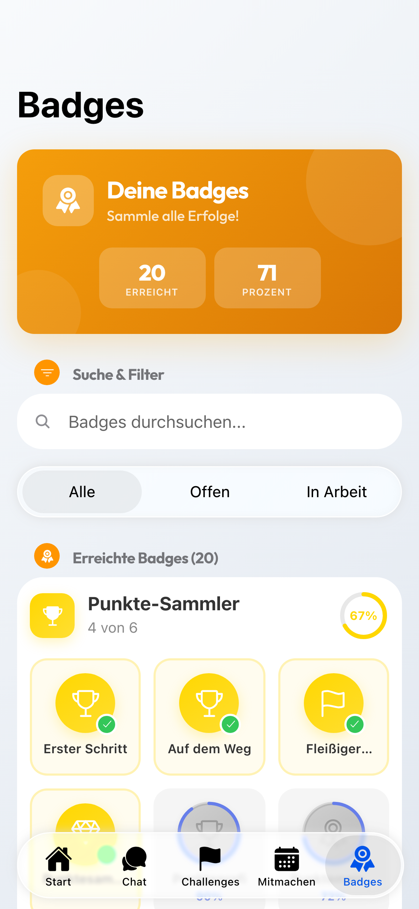

<p align="center">
  
</p>

<h1 align="center">Konfi Quest</h1>

<p align="center">
  Die App für die Konfizeit — für Konfis, Teamer:innen und die Gemeindeleitung.<br>
  Punkte sammeln, Termine finden, miteinander reden. Auf iPhone, Android und im Browser.
</p>

<p align="center">
  
  
  
  
  
  
</p>

## Worum es geht

In der Konfizeit passiert viel: Gottesdienste, Freizeiten, Projekte, das
Mitarbeiten in der Gemeinde. Konfi Quest hält fest, wer wobei dabei war —
nicht als Pflichtheft, sondern als etwas, das man gern in die Hand nimmt.

Konfis sammeln zwei Arten von Punkten: für Gottesdienste und für die Gemeinde.
Sie melden sich zu Terminen an, stellen sich Challenges, sammeln Abzeichen und
bekommen am Ende des Jahres einen Rückblick auf ihre Konfizeit.

Teamer:innen begleiten ihre Gruppen, tragen Punkte ein und bekommen einen
eigenen Rückblick. Die Leitung verwaltet Jahrgänge, gibt Anträge frei und behält
den Überblick — auch über mehrere Gemeinden hinweg, sauber voneinander getrennt.

## Funktionen

### Für Konfis
- **Punkte** — Gottesdienst und Gemeinde getrennt, mit Zielen je Jahrgang
- **Termine** — anmelden, abmelden, Warteliste, Check-in per QR-Code
- **Challenges** — Aufgaben mit Foto, Video oder Text, sichtbar im Jahrgangs-Feed
- **Abzeichen** — für Meilensteine, Serien und besondere Anlässe
- **Rückblick** — der eigene Jahresrückblick, teilbar wie eine Story
- **Chat** — Jahrgang, Gruppen, Termine und Direktnachrichten

### Für Teamer:innen
- Eigenes Dashboard mit den betreuten Jahrgängen
- Punkte eintragen, Anträge sichten, Challenges stellen
- Zertifikate und Nachweise (JuLeiCa, Teamer-Card)
- Eigener Jahresrückblick über die geleistete Arbeit

### Für die Leitung
- Jahrgänge, Konfis und Team verwalten
- Aktivitäten, Kategorien und Punkteziele festlegen
- Anträge freigeben, Abzeichen gestalten, Termine anlegen
- Mehrere Gemeinden in einer Anmeldung, streng getrennte Daten

### Überall
- **Ohne Netz nutzbar** — Eingetragenes wird gespeichert und später gesendet
- **Benachrichtigungen** — für Nachrichten, Termine, Punkte und Freigaben
- **Anmeldung per Face ID, Touch ID oder Fingerabdruck**
- **Handbuch in der App** — [auch online lesbar](https://konfi-quest.de/docs/)

## Installation

### App Store

**[Im App Store laden »](https://apps.apple.com/de/app/konfi-quest/id6748016619)**

### Google Play

**[Bei Google Play laden »](https://play.google.com/store/apps/details?id=de.godsapp.konfiquest)**

### Im Browser

**[konfi-quest.de »](https://konfi-quest.de)** — dieselbe Oberfläche, ohne Installation.

### Eigene Gemeinde

Konfi Quest lässt sich für die eigene Gemeinde nutzen. Schreib einfach an
[moin@konfi-quest.de](mailto:moin@konfi-quest.de).

## Bildschirmfotos

<p align="center">
  
  
  
  
</p>

Weitere Ansichten für alle drei Rollen liegen in
[docs/screenshots/](docs/screenshots/).

## Selbst betreiben

```bash
git clone https://github.com/Revisor01/Konfi-Quest.git
cd Konfi-Quest

# Backend
cd backend && npm install && npm start

# Frontend (zweites Terminal)
cd frontend && npm install && npm run dev
```

Das Backend braucht PostgreSQL 15 und eine `.env` mit `DATABASE_URL`,
`JWT_SECRET`, `QR_SECRET` und `ACTIVITY_PHOTO_ENCRYPTION_KEY`. Für
Benachrichtigungen und E-Mail kommen Firebase- und SMTP-Zugangsdaten dazu;
ohne sie läuft alles andere weiter.

Die Mitarbeit am Projekt beschreibt [CLAUDE.md](CLAUDE.md) — vor allem die
Regel, dass ausgelieferte App-Versionen niemals brechen dürfen.

## Versionen

Die vollständige Liste steht in [CHANGELOG.md](CHANGELOG.md).

| Version | Datum | Schwerpunkt |
|---------|-------|-------------|
| **2.1.1** | 2026-09-11 | Fortschritt beim Senden und Laden von Dateien, einzeln einstellbare Benachrichtigungen, Rückblick fürs Team |
| **2.1.0** | 2026-08-29 | Konfispruch im Wortlaut, Ausstehendes ohne Netz sichtbar, Zustellung nach langer Pause |
| **2.0.0** | 2026-08-27 | Challenges, kürzere Ladezeiten, iOS 16.4 als Mindestversion |

## Aufbau

```
Konfi-Quest
├── frontend/          — Ionic 9 + React 19, TypeScript
│   ├── src/
│   │   ├── components/  — nach Rolle getrennt: konfi, teamer, admin, shared
│   │   ├── contexts/    — App-Zustand, Abzeichen, Anmeldung
│   │   ├── services/    — API, Offline-Warteschlange, Biometrie, Push
│   │   └── __tests__/   — 1625 Tests
│   ├── ios/ · android/  — Capacitor 8
│   └── public/docs/     — erzeugtes Handbuch und API-Referenz
├── backend/           — Node 22 + Express 5, PostgreSQL 15
│   ├── routes/          — nach Bereich getrennt, RBAC je Route
│   ├── services/        — Push, Abzeichen, Rückblick, E-Mail
│   ├── migrations/      — additiv, nie zerstörend
│   └── tests/           — 2470 Tests gegen eine echte Datenbank
├── docs/              — Quelle für Handbuch, API-Doku und Store-Texte
└── e2e/               — Playwright, gegen den vollen Stack
```

**Worauf es beim Bauen ankommt:**
- **Ausgelieferte Apps nie brechen.** Antwortformen sind ein Vertrag: Aus einem
  Array wird kein Objekt, Felder verschwinden nicht. Wer die Form ändern will,
  legt eine neue Route an.
- **Migrationen laufen additiv** — erst die Spalte dazu, dann beide Stände
  bedienen, Altes erst entfernen, wenn keine alte App mehr darauf zugreift.
- **Jede Verhaltensänderung bekommt Tests, Handbuch und CHANGELOG** im selben
  Commit.
- **Rollentrennung bis in die Datenbank.** Mehrere Gemeinden teilen sich eine
  Instanz, sehen aber nie Daten der anderen.

## Mitmachen

Fehlermeldungen und Vorschläge sind willkommen — gern als
[Issue](https://github.com/Revisor01/Konfi-Quest/issues).

## Lizenz

Konfi Quest steht unter der
[PolyForm Noncommercial License 1.0.0](https://polyformproject.org/licenses/noncommercial/1.0.0),
ergänzt um eine Zusatzbedingung zur Veröffentlichung von Änderungen. Der
vollständige Text steht in [LICENSE](LICENSE).

- **Erlaubt:** Kirchengemeinden, Kirchenkreise und andere gemeinnützige
  Einrichtungen dürfen Konfi Quest nutzen, selbst hosten, anpassen und
  weitergeben. Ebenso private Nutzung, Forschung und Lehre.
- **Nicht erlaubt:** jede kommerzielle Nutzung, insbesondere Weiterverkauf oder
  der entgeltliche Betrieb als Dienstleistung.
- **Pflicht bei Änderungen:** Wer den Code verändert und die veränderte Fassung
  Dritten bereitstellt — auch als gehosteten Dienst —, muss den Quelltext der
  Änderungen öffentlich und unentgeltlich zugänglich machen, unter denselben
  Bedingungen.

Für kommerzielle Nutzung oder abweichende Vereinbarungen: einfach anfragen.

## Kontakt

Pastor Simon Luthe · [moin@konfi-quest.de](mailto:moin@konfi-quest.de) ·
[konfi-quest.de](https://konfi-quest.de)
